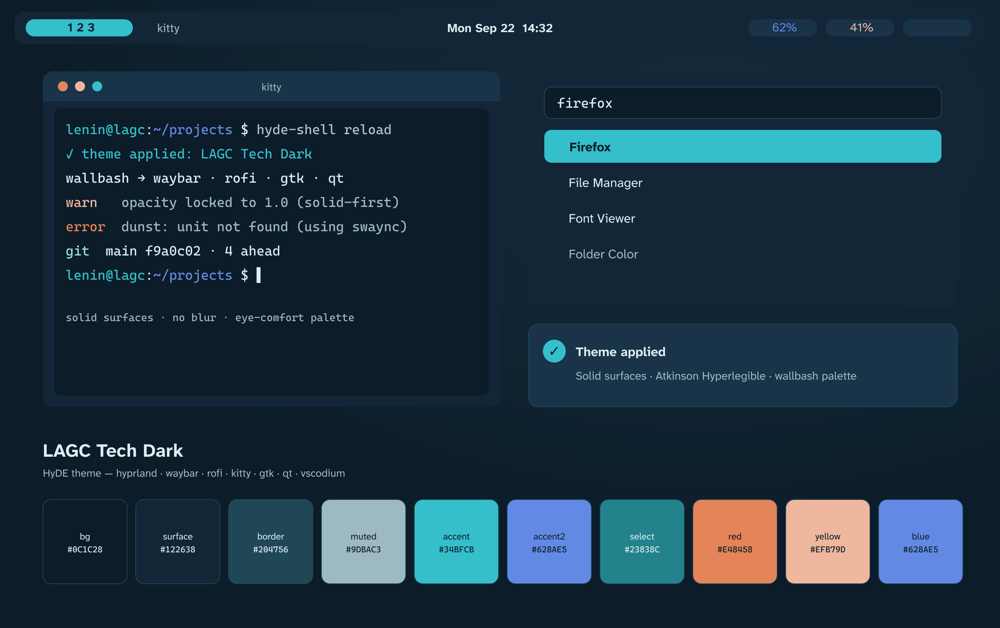
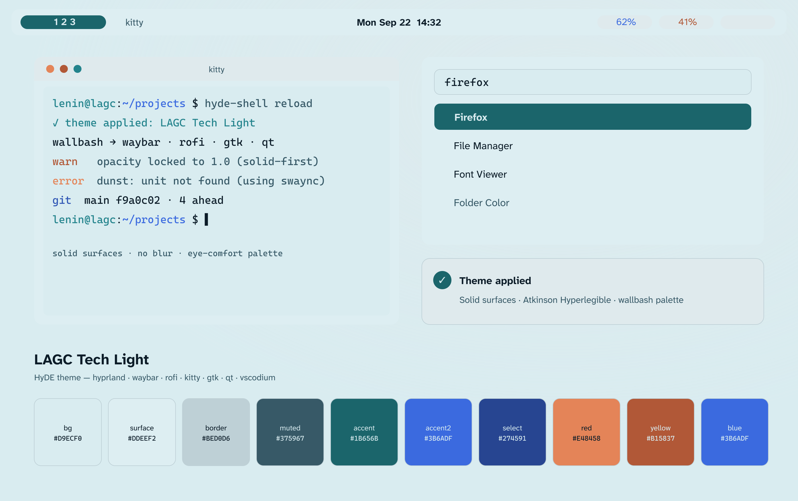
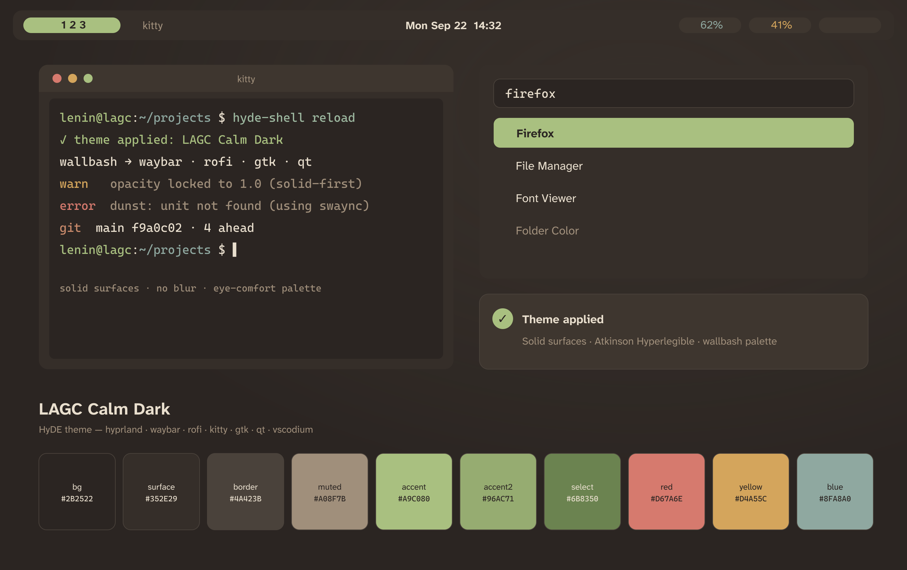
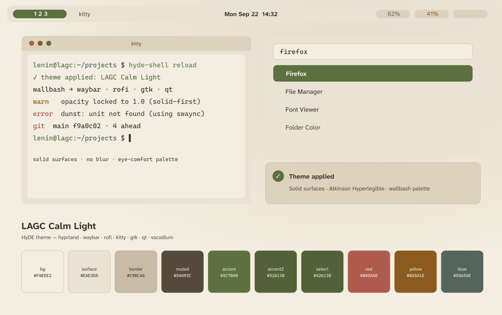

# My HyDE dots

Personal, update-safe overlay for [HyDE](https://github.com/HyDE-Project/HyDE) on Arch Linux.

This repository intentionally stores only user-owned overrides. It does not fork or overwrite HyDE's shared runtime under `~/.local/share/hyde`, `~/.local/share/hypr`, or `~/.local/lib/hyde`.

Codex and other compatible coding agents should follow [`AGENTS.md`](AGENTS.md) when maintaining or applying this overlay. It defines the upstream boundary, safe change workflow, component-specific rules and required validation.

Durable operational decisions and incident mitigations live in [`memory/index.md`](memory/index.md). This repository memory is portable and reviewable; it deliberately excludes chat history, secrets and generated machine state.

## Included

- Hyprland monitor layout, Spanish keyboard layouts, and a fully solid visual layer: opaque windows and surfaces, 8 px squircle corners, palette-driven shadows, a looping border gradient, and WCAG AA state colors defined per theme.
- UI font pairing: `Inter` Medium (official `inter-font` package) drives GTK/Qt/documents/menus, while `Atkinson Hyperlegible Next` SemiBold stays on the Waybar, with a sharp LCD fontconfig baseline (`hintslight` + `rgba=rgb` + `lcddefault`). The installer fetches the static Next weights from the upstream `googlefonts` repo for the bar; the packaged classic `ttf-atkinson-hyperlegible` stays as the offline fallback family.
- User-owned fontconfig baseline at `~/.config/fontconfig/fonts.conf`, installed and snapshotted by this overlay.
- A reversible `Material Sakura Polished` theme variant with clearer, icon-bearing Qt context menus and moderate spacing, while preserving HyDE's Kvantum/Wallbash pipeline.
- Native `LAGC Tech Dark` and `LAGC Tech Light` themes derived from the lagc-tech midnight/frost/cobalt/cyan/ember palette. They use HyDE's supported theme-switch, Wallbash, Waybar, Kitty and Rofi contracts, and drive Dunst plus Kvantum through the standard Wallbash templates.
- Native `LAGC Calm Dark` and `LAGC Calm Light` warm low-glare themes with static `theme.dcol` palettes (sage/olive accents, WCAG AA state colors) and installer-generated gradient wallpapers.
- A portable VSCodium extension (`igunublue.lagc-themes`) with all four `LAGC` color themes — Calm and Tech, dark and light — installed only through VSCodium's own VSIX CLI.
- Compact solid Waybar layout with a historical 22-pixel height, scoped GTK minimum-size overrides, and mandatory mixed-scale display validation.
- Pinned GPLv3 `Future-cyan` cursor theme at visually accepted logical size 46, with native Hyprcursor plus XCursor fallback, reviewed hotspot corrections, and consistent HyDE/session/GTK defaults. Because Hyprcursor and XCursor sizes do not translate 1:1, GTK/Qt/XWayland clients use `XCURSOR_SIZE=32` (via `environment.d`) while the compositor keeps `HYPRCURSOR_SIZE=46`; a `gtk3-cursor-fix` systemd path unit restores the GTK3 value after each HyDE theme switch, which rewrites `settings.ini` with the compositor size.
- Kitty user configuration with an 11 pt default font and 0.97 background opacity: the only remaining transparency in the profile.
- Solid Rofi launcher (opaque wallpaper-matched background) and Wallbash-generated `hyde-wallbash` themes for btop, OpenCode and Codex, all driven by the tracked templates under `~/.config/hyde/wallbash/`. The agent CLI themes are regenerated on every theme, wallpaper and mode switch, track the active palette (Calm or Tech, dark or light), preserve each client's semantic color roles, and are safe when the CLIs are not installed. An `always/` hook also pins `gtk-application-prefer-dark-theme` in `~/.config/gtk-3.0/settings.ini` to the active mode, because HyDE never writes that key — without it, GTK clients like Chromium in "Use GTK" mode stay light on dark themes.
- Temporary Hypridle mitigation that keeps 60-second dimming but disables automatic lock, DPMS-off and suspend while the Hyprlock 0.9.6 input issue is unresolved.
- Dual-screen brightness popup for the laptop panel and LG ULTRAGEAR through DDC/CI.
- Clean Zsh startup without an automatic Fastfetch banner, plus paths for Bun, Volta, PNPM global CLIs, Linuxbrew and Kiro while leaving HyDE in charge of Starship and Oh My Zsh.
- Optional wallpaper restoration from Nextcloud.

## Visual layer

The visual profile is intentionally solid-first because diffuse blur causes eye strain. Windows and every user-owned surface remain fully opaque; shadows and borders preserve depth, and Kitty is the only surface that keeps a small transparency.

- `dotfiles/.config/hypr/hyprland.lua` disables compositor blur and inner glow, keeps `decoration.shadow` plus the LAGC border gradient, and uses `rounding = 10` with `rounding_power = 2.4` (squircle).
- Waybar `bar-bg` and islands render at full opacity, Rofi uses an opaque `main-bg`, and the swaync control center and notification popups are forced to `opacity: 1` from `user-style.css`. Kitty keeps `background_opacity 0.97`.
- Each `waybar.theme` defines per-theme semantic state colors (`wb-ok-fg`, `wb-info-fg`, `wb-warn-fg`, `wb-crit-fg`) chosen to meet WCAG AA (>= 4.5:1) on `main-bg`; the stock Signal Cyan and Cobalt text accents failed that bar on the opposite theme.
- HyDE's shared layer rules enable blur by default, so the user override explicitly disables it for `rofi`, `notifications`, `waybar` and `logout_dialog`. The Waybar layer keeps its 22 px geometry and the same mixed-scale validation requirement.
- HyDE owns the animation timings. Choose a preset with `SUPER + SHIFT + Y` and scale every preset from `config.toml` with `[hyprland.anim] duration_scale = 0.9` (`0.9` is 10 % faster).

Companion selectors ship with HyDE and are deliberately not tracked here, because they are per-machine state:

```bash
hyde-shell animations --select   # SUPER + SHIFT + Y
hyde-shell hyprlock --select     # SUPER + SHIFT + U
hyde-shell shaders --select      # screen shader: vibrance, wallbash, custom
hyde-shell theme.import --select # gallery themes with GTK, icon and font assets
```

Notes for later changes:

- The Hyprland wiki documents the `latest git` branch. This machine runs 0.56.2, which has no `decoration.blur.variant` (the `acrylic`, `frost`, `aurora`, `water` liquid-glass variants) and no `decoration.wobble`. Verify any option with `hyprctl getoption` before trusting a snippet.
- With the Lua parser `hyprctl keyword` no longer works (`keyword can't work with non-legacy parsers. Use eval`). Preview a change with `hyprctl eval 'hl.config({...})'` and revert with `hyde-shell -r`.

## Fresh installation

1. Install or update official HyDE first.
2. Restore the Nextcloud wallpaper folder if desired.
3. Clone and apply this overlay:

```bash
git clone git@github.com:IGUNUBLUE/My-HyDE-dots.git
cd My-HyDE-dots
./install.sh --dry-run
./install.sh
```

Run interactively on a terminal and the installer shows a guided flow — module picker (full, themes-only, cursor-only, or custom), a pacman confirmation, one up-front `sudo` prompt kept alive while steps run, a spinner per step, and a closing summary with the backup path. It bootstraps `gum` (official Arch package) for the UI when missing. Non-interactive runs — piped input, `--yes`, `--dry-run`, or no `gum` — print plain output and accept defaults, so CI and scripts are unaffected. Modules can also be selected explicitly with `--only packages,cursor,config,themes,apply`; every step logs to `~/.local/state/my-hyde-dots/install-<timestamp>.log`.

## Official HyDE integration

The overlay stays within HyDE's documented user-owned extension points. It does not patch the shared runtime, generated Waybar files, or theme output in place.

| Customization | Supported HyDE location |
| --- | --- |
| Main preferences and cursor | `~/.config/hyde/config.toml` with the upstream schema |
| Hyprland Lua overrides | `~/.config/hypr/hyprland.lua` |
| Hypridle safety policy | `~/.config/hypr/hypridle.conf` |
| Waybar layout, module and CSS | `~/.config/waybar/layouts/`, `modules/`, and `user-style.css` |
| Swaync notification CSS | `~/.config/swaync/user-style.css` |
| Wlogout power menu style | `~/.config/wlogout/style_1.css` |
| Themes and wallpapers | `~/.config/hyde/themes/<theme>/` with `wallpapers/` and `wall.set` |
| Wallbash templates and callbacks | `~/.config/hyde/wallbash/always/` and `scripts/` |
| Shell and terminal overrides | `~/.config/zsh/user.zsh` and `~/.config/kitty/kitty.conf` |

HyDE continues to own `~/.local/share/hyde`, `~/.local/share/hypr`, `~/.local/share/waybar`, `~/.local/lib/hyde`, and Waybar's generated `config.jsonc`, `style.css`, and `theme.css`.

The installer uses only official Arch packages, backs up every replaced file or symlink-rich managed tree, installs the pinned user-owned cursor payload, prepares the user Kvantum template from installed HyDE, and selects the custom Waybar layout through HyDE's own commands.

To use another wallpaper:

```bash
MY_HYDE_WALLPAPER=/absolute/path/image.png ./install.sh
```

## LAGC Tech themes




The overlay installs two native HyDE themes without committing any private wallpaper content. HyDE's graphical theme selector identifies themes only by the image referenced by each theme's `wall.set`; it hides the theme name. To keep the Dark and Light cards recognizable, `install.sh` uses ImageMagick to create distinct palette-tinted variants of the selected wallpaper under each theme's supported `wallpapers/` directory, points `wall.set` to that local variant, and refreshes each theme through HyDE's documented wallpaper-cache command. The generated images are reversible installation state and are never added to Git.

The default source is `~/Nextcloud/my_wallpapers/banner-ai-v4-painterly-companion.png`. Provide another source with `MY_HYDE_WALLPAPER`:

```bash
MY_HYDE_WALLPAPER=/absolute/path/image.png ./install.sh
```

Open HyDE's official selector or switch directly:

```bash
hydectl theme select
hydectl theme set "LAGC Tech Dark"
hydectl theme set "LAGC Tech Light"
```

Both themes render GTK3/GTK4 apps through the Wallbash-generated `Wallbash-Gtk` theme and use `Tela-circle-blue` icons, so app interiors follow the active palette exactly. The palette itself is an eye-comfort refresh of the original neon set: a uniform HSL transform desaturates accents ~28% and clamps extreme lightness while preserving the navy/cyan/cobalt identity. HyDE's standard Wallbash pipeline applies the palette to Swaync and Kvantum; no shared HyDE runtime files are overwritten. A user-owned Wallbash post-render callback keeps the Light theme's Rofi window-switcher selection on the softened cyan accent after the shared opaque-Rofi template runs, without changing Kvantum's highlight and link roles.

## LAGC Calm themes




`LAGC Calm Dark` and `LAGC Calm Light` are a warm low-glare pair designed for eye comfort: charcoal `#2B2522`/parchment `#E9DFCE` with a sage `#A9C080` accent on dark, and sepia paper `#F4EEE2`/ink `#3A342C` with a deep olive `#5C7040` accent on light. Both ship a `theme.dcol` static Wallbash palette, so `colors.conf`, Waybar, Rofi, Swaync, Kvantum and Kitty always render the same palette instead of deriving colors from the wallpaper (the default HyDE behavior for themes without `theme.dcol`, which makes a switch look partially applied).

Both variants use `Wallbash-Gtk` for GTK3/GTK4 apps and `Tela-circle-green` icons, matching the sage/olive accent family. `install.sh` downloads each theme's wallpaper from Wallhaven (dark: `7jwx8v`, a misty golden forest path originally from Flickr user peste76; light: `ly8xwr`, a foggy morning garden originally from Unsplash photo `m1Jnyio2pUs`) and falls back to a deterministic ImageMagick gradient when offline, so no wallpaper binary is committed and installs never fail on a missing image. All interactive and state colors meet WCAG AA on their surfaces.

```bash
hydectl theme set "LAGC Calm Dark"
hydectl theme set "LAGC Calm Light"
```

## Future-cyan cursor

The default cursor is the GPLv3 [Future-cyan](https://www.gnome-look.org/p/1465392) theme from [Future-cursors](https://github.com/yeyushengfan258/Future-cursors), pinned to commit `587c14d2f5bd2dc34095a4efbb1a729eb72a1d36`. That upstream revision explicitly improves hotspot consistency. The reviewed compiled XCursor payload, license and provenance are tracked under `dotfiles/.local/share/icons/Future-cursors/`; installation does not download or execute third-party code.

For native compositor support, the overlay also pins the GPLv3 [Future Cyan Hyprcursor port](https://gitlab.com/Pummelfisch/future-cyan-hyprcursor) at `cf4126d17f4520aceb688d8a60daca4a1f0b9e80`. Its reviewed SVG working source lives under `cursor-sources/Future-cyan-hyprcursor/` and is compiled locally with `hyprcursor-util` during installation. The overlay uses one `Future-cursors` identifier for both formats and adjusts the native arrow and link-pointer hotspots to the corrected original ratios.

HyDE and native Hyprcursor select `Future-cursors` at the visually accepted logical size 46, while the login environment, GSettings and XCursor clients use the visually equivalent size 32 — Hyprcursor and XCursor sizes are not 1:1, and equal values render GTK/Qt cursors roughly 1.4x larger. On the mixed-scale outputs, 36 was too small while 48 appeared oversized and blurred on the scale-1.0 external monitor. Existing applications can retain their inherited cursor environment, so log out and back in after the first installation before judging every GTK/XWayland client. Hotspot acceptance still requires clicking small targets and checking arrow, link, text and resize shapes on both monitors.

Reference: [HyDE main configuration](https://hydeproject.pages.dev/en/configuring/config_toml/) and [HyDE cursor guidance](https://github.com/HyDE-Project/HyDE/discussions/624).

## VSCodium themes

The overlay also includes a VS Code-compatible extension containing four selectable themes — `LAGC Calm Dark`/`Light` (charcoal-brown, parchment, sage) and `LAGC Tech Dark`/`Light` (deep navy, softened cyan/blue accents with reduced glare). It does not copy files into VSCodium's extension directory. Instead, the installer builds a temporary VSIX from `dotfiles/.local/share/vscodium/themes/lagc-themes/` and passes it to VSCodium's supported CLI:

```bash
./install.sh --vscodium-theme-only
```

The normal `./install.sh` flow installs or updates the same extension whenever the `codium` CLI is available. In VSCodium, use **Preferences: Color Theme** (`Ctrl+K`, then `Ctrl+T`) and select `LAGC Calm Dark` or `LAGC Calm Light`. To remove only this overlay-owned extension:

```bash
./restore.sh --vscodium-theme-only
```

## Restore the previous configuration

```bash
./restore.sh
```

Pass a specific directory under `~/.local/state/my-hyde-dots/backups/` to restore an older snapshot.

## Capture later changes

```bash
./update-snapshot.sh
./check.sh
git diff
git add .
git commit -m "Update HyDE preferences"
git push
```

Always review the diff before committing. Histories, caches, credentials, KWallet, browser profiles and generated HyDE state are deliberately excluded.

## Repository memory

Before changing a component, read `memory/index.md` and its relevant active entries. Create new memories from `memory/template.md`; resolve rather than delete old decisions so future installations retain the reason behind important safeguards.

## Hardware assumptions

The current Hyprland override targets:

- Laptop display: `eDP-1`, scale `1.25`.
- External display: `LG ULTRAGEAR`, scale `1`, positioned at `1536x0`.
- DDC/CI model name: `LG ULTRAGEAR`.

Edit the two hardware-specific files before installing on a different machine:

- `dotfiles/.config/hypr/hyprland.lua`
- `dotfiles/.local/bin/hyde-brightness-panel`

## Upstream conventions followed

- `~/.config/hypr/hyprland.lua` is HyDE's preserved Lua override.
- `~/.config/hypr/hypridle.conf` is HyDE's preserved idle override; automatic locking must be restored only after a controlled lock/unlock test succeeds.
- `~/.config/hyde/config.toml` is HyDE's preserved user configuration.
- `~/.config/fontconfig/fonts.conf` is the user-owned font rendering baseline; system `/etc/fonts` presets stay untouched.
- Custom Waybar layouts and modules live under `~/.config/waybar/`.
- `~/.config/kitty/kitty.conf` is the preserved Kitty override; HyDE remains responsible for `hyde.conf` and `theme.conf`.
- `~/.config/zsh/user.zsh` is the preserved Zsh customization point.
- `~/.config/wlogout/style_1.css` is the envsubst template consumed by `logoutlaunch.sh` for the default `WLOGOUT_STYLE=1`. The overlay adds a soft drop shadow to the buttons and paints the focused selection in Signal Cyan through the `wb-hvr-bg`/`wb-hvr-fg` tokens imported from `waybar/theme.css`, keeping it theme-relative. HyDE continues to own `layout_*`, `icons/` and the launcher script.
- `~/.config/swaync/user-style.css` is swaync's preserved user stylesheet, imported after the generated `theme.css`. The overlay uses it to re-map the hardcoded white `text-color`/`--text-color` onto the active theme's own notification text color, keeping notification popups and the control center readable on light themes. HyDE continues to own `style.css`, `theme.css` and `config.json`.
- `~/.config/hyde/wallbash/` is HyDE's documented user template directory and takes precedence over the shared templates that ship with HyDE. Only the overlay's own templates are tracked: `always/rofi-frosted.dcol`, `always/btop.dcol`, `always/dunst.dcol`, `always/opencode.dcol`, `always/codex.dcol`, `always/gtk-dark-mode.dcol` and their `scripts/` selectors.
- Agent CLI theming writes only each client's documented custom theme directory: `~/.config/opencode/themes/hyde-wallbash.json` (selected via `theme.name` in `cli.json`, or the legacy `tui.json`/`opencode.json` string) and `~/.codex/themes/hyde-wallbash.tmTheme` (selected via `[tui] theme` in `config.toml`). The selector scripts rewrite only the theme key and preserve every other setting; OpenCode TUI instances reload on `SIGUSR2`, while Codex applies the theme on its next launch.
- Qt menu changes live in a derived theme under `~/.config/hyde/themes/Material Sakura Polished`; the original `Material Sakura` theme and HyDE's generated `~/.config/Kvantum/wallbash` files remain untouched.
- Shared files managed by HyDE remain untouched.

## Qt menu preferences

Run `./install.sh --qt-menu-only --skip-packages` to apply only the menu settings. New Qt windows use the current theme with your persistent menu preferences. GTK and browser-owned menus are outside this customization. Shadow shape remains defined by the active theme SVG. The old Material Sakura Polished copy may remain locally for rollback but is no longer needed.

The template and callback are recorded in the normal backup manifest. After `./restore.sh`, reselect your current theme to regenerate Kvantum with the restored template. No wallpaper or generated Kvantum configuration is stored in Git.

Reference: [HyDE Wallbash templates and post-processing](https://github.com/HyDE-Project/HyDE/blob/master/Configs/.config/hyde/wallbash/README.md).
